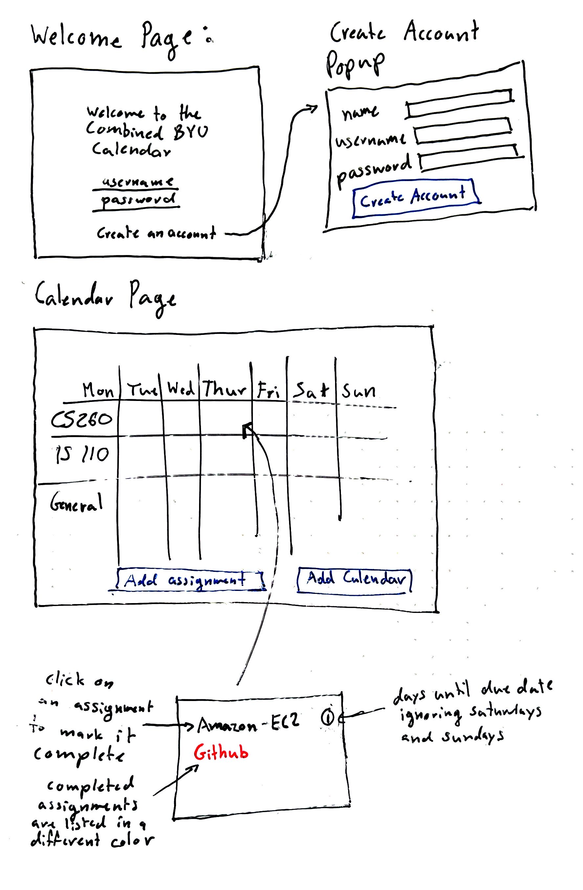
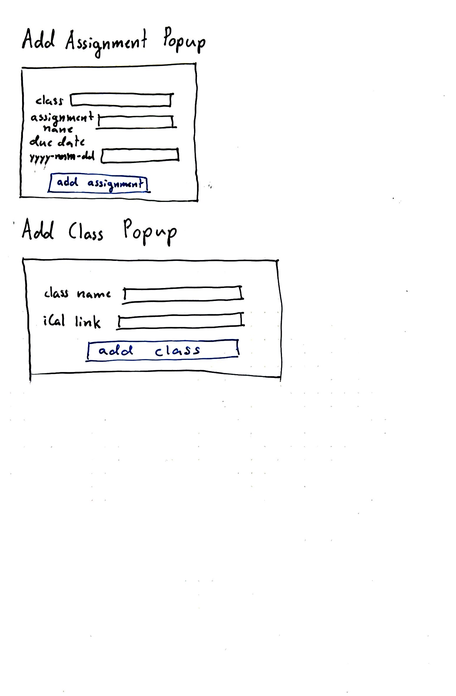

# Combined BYU Calendar
This is a repository for my BYU CS 260 startup.

## Specification Deliverable
### Elevator pitch
Imagine having all your BYU class assignments from Learning Suite and Canvas in one easy-to-read calendar. My web service does just that. Simply input your classes' iCal feeds, and it'll create a unified weekly view of all your upcoming assignments with countdowns. Access it from any device, check off completed tasks, and stay organized effortlessly. No more juggling multiple platforms – it brings everything together in one place, accessible anytime, anywhere.[^*]

### Design
Here are some rough sketches of how the inteface will look and operate.

### Key features
- Secure login over HTTPS
- Ability to add class calendars by using an iCal link
- Calendars automatically update with iCal alterations
- Ability to add custom assignments
- Assignment week view with assignments listed with the days until their completion
- Ability to display the current school week
- Assignment completion status is persistently stored
- Assignment completion state updated in real time
- Calendars and assignments are persistently stored

### Technologies
I am going to use the required technologies in the following ways:

- **HTML** - Uses HTML for structure of the webpages and their corresponding pop ups. There will be two pages: a sign in screen and a calendar page. There will be three pop up menus: a create account menu, an add assignment menu, and an add class menu.
- **CSS** - Makes the website usable on different types of screens. The idea is to make it possible to use the website on a laptop and a phone and have the experience be consistent. The calendar itself will look clean and neat. Color assignments based on their completion status.
- **Javascript** Provides login, creat account, add assignment, and add calendar backend endpoint calls.
- **React** - It will be used to make it so the website does not have to fully refresh to display new assignment and calendar data.
- **Service** - Backend service with endpoints for:
    - login
    - retrieving calendar data
    - retrieving assignments and their data
    - pulls down iCal updates every five minutes or so to match instructor changes
    - parsing of iCal feed (using a parser API like https://github.com/nponsard/ical.ts)
- **DB/Login** - Store calendar data and assignment data in a database. Credentials securly stored in a database. Only those with an account can have a calendar and calendars' status are not shared between users.
- **WebSocket** - Provide calendar updates, adding a calendar or assignment will effect all the instances logged in with the same credentials, checking off an assignment will effect all instances of the calendars with the same credentials, notify users of an instructor change and gives them the option to accept it.

## HTML deliverable

For this deliverable I built out the structure of my calendar webservice using HTML.

- [x] **HTML pages** - Two HTML pages, the first one is a login screen and the second is the calendar itself
- [x] **Links** - The login page has buttons to get to the calendar page. The calendar page has a sign-out button to get to the login page.
- [x] **Text** - A sample calendar is included with the events having tags that will be utilized later.
- [ ] **Images** - In progress.
- [x] **Popup Menus** - Four Popup menus: Create Account, Add Calendar, Add Event, and Add Assignment. (I decided to sperate events and assignments to improve simplicity)
- [x] **DB:Login** - The input and submit boxes for login and to create an account.
- [x] **DB:Calendars,Events,Assignments** - The input and submit boxes for adding calendars, events and assignments. 
- [x] **3rd Party Service Calls** - When a new calendar is imported a service call is made to parse the data and store it in the database.
- [x] **WebSocket** Calendar data is pulled from the database when a user signs in and when it is updated on any device accross devices.

## CSS deliverable
## React deliverable
## Service deliverable
## DB/Login deliverable
## WebSocket deliverable

# Class Notes
The [notes.md](notes.md) file contains my notes from the class.

[^*]: Text in this section is combination of my personal work and assistance from perplexity ai to improve conciseness and clarity.
