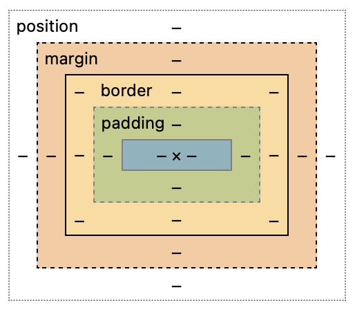

# Class Notes
This file can be used on the midterm and final

<details>
<summary><h2>Git and GitHub</h2></summary>

---

Today (2024-09-14) I learned about some basic Git command and about GitHub.

### Git
- clone
Clones a working repository using an HTTPS link
- add
Preps file changes to be commited
- commit
Preps all added file changes with a comment
- push
Pushes all commited file changes to the online repository
- fetch
Gets the latest information about the changes on GitHub
- status
Displays the differences between the clone and the repo
- pull
Pulls current main repo with all its changes

### GitHub
An online location to host repositories to be able to access them in one place and to access other people's repositories.
</details>

<details>
<summary><h2>Amazon Web Services - EC2</h2></summary>

---

You can ssh into your server using the format:
```sh
➜  ssh -i [key pair file] ubuntu@[ip address]
```

The public ip address for my server is currently: 35.170.208.120
</details>

<details>
<summary><h1>HTML</h1></summary>

<details>
<summary><h2>HTML Structure</h2></summary>

---

### Purpose of HTML
HTML serves two main purposes:
1. Provide structure
2. Provide content

### Common HTML Structural Elements
There are several common structural elements, including:

- body, header, footer, main
- section ~ Used to compartmentalize sections
- aside ~ A different way to compartmentalize a section
- p (paragraph) ~ Used for unanchored text
- table ~ Used for building a table
- ol/ul (ordered/unordered lists) ~ The two ways to make lists
- div ~ Yet another way to compartmentalize a section that doen't span the length of the screen
- span ~ A section that spans the length of the screen

### Document Structure
These elements are typically used to structure an HTML document:

- The **body** is the top-level content container.
- The body usually has three main children: **header**, **main**, and **footer**.
- Each of these children contains other structural content:
  - The **header** often includes a paragraph with a span and navigation with divisions.
  - The **main** section typically contains multiple sections with lists or tables, and may include an aside for content that doesn't fit the main flow.
  - The **footer** usually has a content division, often with a span.

### Importance of Proper Structure
Using the correct structural elements is crucial for:
1. Logical organization for programmers
2. Proper interpretation by automated tools like search indexing crawlers
3. Accessibility for screen readers

### Block vs. Inline Elements
There is a distinction between block and inline elements:

- **Block elements** create distinct blocks in the content flow (e.g., div, p).
- **Inline elements** fit within the content flow of block elements without disrupting it (e.g., b, span).

#### My CodePen file
[html:structure](https://codepen.io/Nexkiv/pen/JjgPZBr)

</details>

<details>
<summary><h2>HTML Input</h2></summary>

---

This section discussed HTML input elements and their importance in web forms.

### Purpose of Input Elements
Input elements are useful for creating interactive web applications, allowing users to provide data that can be processed and stored.

### Common Input Elements
The document lists several input elements, including:

text, password, email, number, tel, url, date, datetime-local, month, week, time, color, file, checkbox, radio, range, reset, submit, etc...

### Input Attributes
Important attributes for input elements are discussed:

- **name**: Identifies the input when submitting to a server
- **value**: Specifies the current value of the input
- **required**: Indicates if the input must have a value
- **placeholder**: Provides an example of what to enter
- **autocomplete**: Suggests previous values as the user types
- **autofocus**: Automatically focuses the input on page load
- **spellcheck**: Enables spell checking for text

### Form Element
Input elements are typically wrapped in a **form** element, which:

1. Groups related inputs
2. Enables collective submission of input values

### Label Element
The importance of the **label** element is highlighted as:

- Associating text with an input element
- Increasing usability by expanding the clickable area
- Improving accessibility for screen readers

### Output Element
The **output** element is introduced as a way to represent the result of a calculation or user action within a form.

#### My CodePen file
[html:input](https://codepen.io/Nexkiv/pen/PoMYaMr)

</details>

<details>
<summary><h2>HTML Media</h2></summary>

---

This section discussed HTML media elements and their usage in web development.

### HTML Media Elements
Five main media elements were covered:
- img
- audio
- video
- svg
- canvas

### External Media
There are two ways to reference external media using URLs:

- Full paths include protocol, domain name, and file path
- Relative paths are preferred for easier code portability

#### Image Element
The `img` element is used to include images:
- Requires a `src` attribute with the image URL
- Should include an `alt` attribute for accessibility

#### Audio Element
The `audio` element is used for including audio files:
- Requires a `src` attribute with the audio file URL
- Optional attributes include `controls`, `autoplay`, and `loop`
- Autoplay is discouraged without user opt-in

#### Video Element
The `video` element is used for including videos:
- Requires a `src` attribute with the video file URL
- Can include `controls` and `autoplay` attributes
- May need `crossorigin="anonymous"` for files from different domains

### Internal Media
The section discussed two elements for creating images within HTML:

#### SVG (Scalable Vector Graphics)
- Allows inline creation of graphics in HTML
- Can be combined with JavaScript and CSS for complex visualizations

#### Canvas
- Introduced for 2D drawing and animation
- Requires JavaScript for actual drawing on the canvas

### My CodePen file
[html:media](https://codepen.io/Nexkiv/pen/OJKLwVL)

</details>

</details>

<details>
<summary><h2>Midterm Questions</h2></summary>

<details>
<summary>1. In the following code, what does the link element do?</summary>

> The `<link>` tag defines the relationship between the current document and an external resource.
> The `<link>` tag is most often used to link to external style sheets or to add a favicon to your website.
> The `<link>` element is an empty element, it contains attributes only.
> > https://www.w3schools.com/tags/tag_link.asp

</details>

<details>
<summary>2. In the following code, what does a div tag do?</summary>

> The `<div>` tag defines a division or a section in an HTML document.
> The `<div>` tag is used as a container for HTML elements - which is then styled with CSS or manipulated with JavaScript.
> The `<div>` tag is easily styled by using the class or id attribute.
> Any sort of content can be put inside the `<div>` tag! \
> <b>Note</b>: By default, browsers always place a line break before and after the `<div>` element.
> > https://www.w3schools.com/tags/tag_div.asp

</details>

<details>
<summary>3. In the following code, what is the difference between the #title and .grid selector?</summary>

> A class name, denoted by a `.`, can be used by multiple HTML elements,
> while an id name, denoted by a `#`, must only be used by one HTML element within the page.
> HTML elements can belong to more than one class.\
> To define multiple classes, separate the class names with a space,
> e.g. `<div class="city main">`. The element will be styled according to all the classes specified.
> 
> ****HTML `class` attribute****
> * The HTML `class` attribute specifies one or more class names for an element
> * Classes are used by CSS and JavaScript to select and access specific elements
> * The `class` attribute can be used on any HTML element
> * The `class` name is case sensitive
> * Different HTML elements can point to the same `class` name
> * JavaScript can access elements with a specific `class` name with the `getElementsByClassName()` method
>
> ****HTML `id` attribute****
> * The `id` attribute is used to specify a unique `id` for an HTML element
> * The value of the `id` attribute must be unique within the HTML document
> * The `id` attribute is used by CSS and JavaScript to style/select a specific element
> * The value of the id attribute is case sensitive
> * The `id` attribute is also used to create HTML bookmarks
> * JavaScript can access an element with a specific `id` with the `getElementById()` method
> > https://www.w3schools.com/html/html_classes.asp \
> > https://www.w3schools.com/html/html_id.asp

</details>

<details>
<summary>4. In the following code, what is the difference between padding and margin?</summary>

> 
> 
> ****Padding****: \
> The CSS `padding` properties are used to generate space around an element's content,
> inside of any defined borders.
> With CSS, you have full control over the padding.
> There are properties for setting the `padding` for each side of an element
> (top, right, bottom, and left). \
> `padding: top right bottom left` \
> `padding: top right/left bottom` \
> `padding: top/bottom left/right` \
> `padding: all`
>
> ****Margin****: \
> The CSS `margin` properties are used to create space around elements, outside of any defined borders.
> With CSS, you have full control over the margins.
> There are properties for setting the `margin` for each side of an element
> (top, right, bottom, and left). \
> Follows the same pattern as padding
>
> > https://www.w3schools.com/css/css_padding.asp
> > https://www.w3schools.com/css/css_margin.asp

</details>

<details>
<summary>5. Given this HTML and this CSS how will the images be displayed using flex?</summary>

> The flex container becomes flexible by setting the `display` property to `flex`.\
> The direct child elements of a flex container automatically becomes flexible (flex) items.
> 
> The `flex-direction` property defines in which direction the container wants to stack the flex items. \
> The `column` value stacks the flex items vertically (from top to bottom). \
> The `column-reverse` value stacks the flex items vertically (but from bottom to top). \
> The `row` value stacks the flex items horizontally (from left to right). \
> The `row-reverse` value stacks the flex items horizontally (but from right to left).
> 
> The `flex-wrap` property specifies whether the flex items should wrap or not. \
> The `wrap` value specifies that the flex items will wrap if necessary. \
> The `nowrap` value specifies that the flex items will not wrap (this is default). \
> The `wrap-reverse` value specifies that the flexible items will wrap if necessary, in reverse order.
>
> The `justify-content` property is used to align the flex items. \
> The `center` value aligns the flex items at the center of the container. \
> The `flex-start` value aligns the flex items at the beginning of the container (this is default). \
> The `flex-end` value aligns the flex items at the end of the container. \
> The `space-around` value displays the flex items with space before, between, and after the lines. \
> The `space-between` value displays the flex items with space between the lines.
>
> The `align-items` property is used to align the flex items. \
> The `center` value aligns the flex items in the middle of the container. \
> The `flex-start` value aligns the flex items at the top of the container. \
> The `flex-end` value aligns the flex items at the bottom of the container. \
> The `stretch` value stretches the flex items to fill the container (this is default). \
> The `baseline` value aligns the flex items such as their baselines aligns.
>
> The `align-content` property is used to align the flex lines. \
> The `space-between` value displays the flex lines with equal space between them. \
> The `space-around` value displays the flex lines with space before, between, and after them. \
> The `stretch` value stretches the flex lines to take up the remaining space (this is default). \
> The `center` value displays the flex lines in the middle of the container. \
> The `flex-start` value displays the flex lines at the start of the container. \
> The `flex-end` value displays the flex lines at the end of the container
>
> The `order` property specifies the order of the flex items. \
> The `flex-grow` property specifies how much a flex item will grow relative to the rest of the flex items. \
> The `flex-shrink` property specifies how much a flex item will shrink relative to the rest of the flex items. \
> The `flex-basis` property specifies the initial length of a flex item. \
> The `flex` property is a shorthand property for the `flex-grow`, `flex-shrink`, and `flex-basis` properties.
>
> 
> The `align-self` property specifies the alignment for the selected item inside the flexible container. \
> The `align-self` property overrides the default alignment set by the container's `align-items` property.
>
> | Property | Description |
> |----------|-------------|
> | `align-content` | Modifies the behavior of the flex-wrap property. It is similar to align-items, but instead of aligning flex items, it aligns flex lines |
> | `align-items` | Vertically aligns the flex items when the items do not use all available space on the cross-axis |
> | `display` | Specifies the type of box used for an HTML element |
> | `flex-direction` | Specifies the direction of the flexible items inside a flex container |
> | `flex-flow` | A shorthand property for flex-direction and flex-wrap |
> | `flex-wrap` | Specifies whether the flex items should wrap or not, if there is not enough room for them on one flex line |
> | `justify-content` | Horizontally aligns the flex items when the items do not use all available space on the main-axis |
> | `align-self` | Specifies the alignment for a flex item (overrides the flex container's align-items property) |
> | `flex` | A shorthand property for the flex-grow, flex-shrink, and the flex-basis properties |
> | `flex-basis` | Specifies the initial length of a flex item |
> | `flex-grow` | Specifies how much a flex item will grow relative to the rest of the flex items inside the same container |
> | `flex-shrink` | Specifies how much a flex item will shrink relative to the rest of the flex items inside the same container |
> | `order` | Specifies the order of the flex items inside the same container |
>
> > https://www.w3schools.com/css/css3_flexbox.asp
> > https://www.w3schools.com/css/css3_flexbox_container.asp
> > https://www.w3schools.com/css/css3_flexbox_items.asp
> > https://www.w3schools.com/css/css3_flexbox_responsive.asp

</details>

<details>
<summary>6. What does the following padding CSS do?</summary>

> | Unit | Description |
> |------|-------------|
> | cm | centimeters |
> | mm | millimeters |
> | in | inches (1in = 96px = 2.54cm) |
> | px* | pixels (1px = 1/96th of 1in) |
> | pt | points (1pt = 1/72 of 1in) |
> | pc | picas (1pc = 12 pt) |
> | em | Relative to the font-size of the element (2em means 2 times the size of the current font) |
> | ex | Relative to the x-height of the current font (rarely used)	|
> | ch | Relative to the width of the "0" (zero) |
> | rem | Relative to font-size of the root element	|
> | vw | Relative to 1% of the width of the viewport†	|
> | vh | Relative to 1% of the height of the viewport† |
> | vmin | Relative to 1% of viewport's† smaller dimension |
> | vmax | Relative to 1% of viewport's† larger dimension	|
> | % | Relative to the parent element |
>
> <p>* Pixels (px) are relative to the viewing device. For low-dpi devices, 1px is one device pixel (dot) of the display. For printers and high resolution screens 1px implies multiple device pixels.</p>
> † Viewport = the browser window size. If the viewport is 50cm wide, 1vw = 0.5cm.

> **Tip:** The `em` and `rem` units are practical in creating perfectly scalable layout!
>
> > https://www.w3schools.com/css/css_units.asp

</details>

<details>
<summary>7. What does the following code using arrow syntax function declaration do?</summary>

> If the function has only one statement, and the statement returns a value,
> you can remove the brackets and the `return` keyword.
> If you have parameters, you pass them inside the parentheses.
> In fact, if you have only one parameter, you can skip the parentheses as well.
>
> With a regular function `this` represents the object that calls the function.
> With an arrow function `this` represents the owner of the function

</details>

<details>
<summary>8. What does the following code using map with an array output?</summary>

> You can create a Map by passing an Array to the `new Map()` constructor.
> You can add elements to a Map with the `set()` method.
> The `set()` method can also be used to change existing Map values.
> The `get()` method gets the value of a key in a Map.
> `typeof` returns object.
> `instanceof` Map returns true.
> 
> ```javascript
> // Create a Map
> const fruits = new Map([
> ["apples", 500],
> ["bananas", 300],
> ]);
>
> // Set Map Values
> fruits.set("oranges", 200);
> fruits.set("apples", 200);
>
> fruits.get("apples");    // Returns 500
> ```
>
> > https://www.w3schools.com/js/js_maps.asp

</details>

<details>
<summary>9. What does the following code output using getElementByID and addEventListener?</summary>

> The `getElementById()` method returns an element with a specified value.
> The `getElementById()` method returns `null` if the element does not exist.
> The `getElementById()` method is one of the most common methods in the HTML DOM.
> It is used almost every time you want to read or edit an HTML element. \
> **Note** \
> Any id should be unique, but:
> If two or more elements with the same id exist, `getElementById()` returns the first.
>
> The `addEventListener()` method attaches an event handler to an element.
>
> > https://www.w3schools.com/jsref/met_document_getelementbyid.asp
> > https://www.w3schools.com/jsref/met_element_addeventlistener.asp

</details>

<details>
<summary>10. What does the following line of Javascript do using a # selector?</summary>

<table class="ws-table-all notranslate">
  <tbody><tr>
    <th style="width:20%">Selector</th>
    <th style="width:20%">Example</th>
    <th>Example description</th>
  </tr>
  <tr>
    <td><a href="sel_class.php">.<i>class</i></a></td>
    <td class="notranslate">.intro</td>
    <td>Selects all elements with class="intro"</td>
  </tr>
  <tr>
    <td><em>.class1.class2</em></td>
    <td class="notranslate">.name1.name2</td>
    <td>Selects all elements with both <em>name1</em> and <em>name2</em> set 
    within its class attribute</td>
  </tr>  
  <tr>
    <td><em>.class1 .class2</em></td>
    <td class="notranslate">.name1 .name2</td>
    <td>Selects all elements with <em>name2</em> that is a descendant of an 
    element with <em>name1</em></td>
  </tr>  
  <tr>
    <td><a href="sel_id.php">#<i>id</i></a></td>
    <td class="notranslate">#firstname</td>
    <td>Selects the element with id="firstname"</td>
  </tr>  <tr>
    <td><a href="sel_all.php">*</a></td>
    <td class="notranslate">*</td>
    <td>Selects all elements</td>
  </tr>
  <tr>
    <td><i><a href="sel_element.php">element</a></i></td>
    <td class="notranslate">p</td>
    <td>Selects all &lt;p&gt; elements</td>
  </tr>
  <tr>
    <td><i><a href="sel_element_class.php">element.class</a></i></td>
    <td class="notranslate">p.intro</td>
    <td>Selects all &lt;p&gt; elements with class="intro"</td>
  </tr>
  <tr>
    <td><i><a href="sel_element_comma.php">element,element</a></i></td>
    <td class="notranslate">div, p</td>
    <td>Selects all &lt;div&gt; elements and all &lt;p&gt; elements</td>
  </tr>
  <tr>
    <td><a href="sel_element_element.php"><i>element</i> <i>element</i></a></td>
    <td class="notranslate">div p</td>
    <td>Selects all &lt;p&gt; elements inside &lt;div&gt; elements</td>
  </tr>
  <tr>
    <td><a href="sel_element_gt.php"><i>element</i>&gt;<i>element</i></a></td>
    <td class="notranslate">div &gt; p</td>
    <td>Selects all &lt;p&gt; elements where the parent is a &lt;div&gt; element</td>
  </tr>
  <tr>
    <td><a href="sel_element_pluss.php"><i>element</i>+<i>element</i></a></td>
    <td class="notranslate">div + p</td>
    <td>Selects the first &lt;p&gt; element that is placed immediately after &lt;div&gt; elements</td>
  </tr>
  <tr>
    <td><a href="sel_gen_sibling.php"><i>element1</i>~<i>element2</i></a></td>
    <td>p ~ ul</td>
    <td>Selects every &lt;ul&gt; element that is preceded by a &lt;p&gt; element</td>
  </tr>
  <tr>
    <td><a href="sel_attribute.php">[<i>attribute</i>]</a></td>
    <td class="notranslate">[target]</td>
    <td>Selects all elements with a target attribute</td>
  </tr>
  <tr>
    <td><a href="sel_attribute_value.php">[<i>attribute</i>=<i>value</i>]</a></td>
    <td class="notranslate">[target="_blank"]</td>
    <td>Selects all elements with target="_blank"</td>
  </tr>
  <tr>
    <td><a href="sel_attribute_value_contains.php">[<i>attribute</i>~=<i>value</i>]</a></td>
    <td class="notranslate">[title~="flower"]</td>
    <td>Selects all elements with a title attribute containing the word "flower"</td>
  </tr>
  <tr>
    <td><a href="sel_attribute_value_lang.php">[<i>attribute</i>|=<i>value</i>]</a></td>
    <td class="notranslate">[lang|="en"]</td>
    <td>Selects all elements with a lang attribute value equal to "en" or 
    starting with "en-"</td>
  </tr>
  <tr>
    <td><a href="sel_attr_begin.php">[<i>attribute</i>^=<i>value</i>]</a></td>
    <td>a[href^="https"]</td>
    <td>Selects every &lt;a&gt; element whose href attribute value begins with "https"</td>
  </tr>
  <tr>
    <td><a href="sel_attr_end.php">[<i>attribute</i>$=<i>value</i>]</a></td>
    <td>a[href$=".pdf"]</td>
    <td>Selects every &lt;a&gt; element whose href attribute value ends with ".pdf"</td>
  </tr>
  <tr>
    <td><a href="sel_attr_contain.php">[<i>attribute</i>*=<i>value</i>]</a></td>
    <td>a[href*="w3schools"]</td>
    <td>Selects every &lt;a&gt; element whose href attribute value contains the substring "w3schools"</td>
  </tr>
</tbody>
</table>

> > https://www.w3schools.com/cssref/css_selectors.php

</details>


<details>
<summary>11. Which of the following are true? (mark all that are true about the DOM)</summary>

> When an HTML document is loaded into a web browser, it becomes a document object.
> The document object is the root node of the HTML document.
> The document object is a property of the window object.
> The document object is accessed with:
> `window.document` or just `document`

<table class="ws-table-all notranslate">
<tbody><tr>
    <th>Property / Method</th>
    <th>Description</th>
</tr>
<tr>
    <td><a href="prop_document_activeelement.asp">activeElement</a></td>
    <td>Returns the currently focused element in the document</td>
</tr>
<tr>
    <td><a href="met_document_addeventlistener.asp">addEventListener()</a></td>
    <td>Attaches an event handler to the document</td>
</tr>
<tr>
  <td><a href="met_document_adoptnode.asp">adoptNode()</a></td>
  <td>Adopts a node from another document</td>
</tr>
<tr>
    <td><a href="coll_doc_anchors.asp">anchors</a></td>
    <td><span class="deprecated"><a href="coll_doc_anchors.asp">Deprecated</a></span></td>
</tr>
<tr>
    <td><a href="coll_doc_applets.asp">applets</a></td>
    <td><span class="deprecated"><a href="coll_doc_applets.asp">Deprecated</a></span></td>
</tr>
<tr>
  <td><a href="prop_doc_baseuri.asp">baseURI</a></td>
  <td>Returns the absolute base URI of a document</td>
</tr>
<tr>
    <td><a href="prop_doc_body.asp">body</a></td>
    <td>Sets or returns the document's body (the &lt;body&gt; element)</td>
</tr>
  <tr>
  <td><a href="prop_document_charset.asp">charset</a></td>
  <td><span class="deprecated"><a href="prop_document_charset.asp">Deprecated</a></span></td>
  </tr>
  <tr>
  <td><a href="prop_document_characterset.asp">characterSet</a></td>
  <td>Returns the character encoding for the document</td>
  </tr>
<tr>
    <td><a href="met_doc_close.asp">close()</a></td>
    <td>Closes the output stream previously opened with document.open()</td>
</tr>
<tr>
    <td><a href="prop_doc_cookie.asp">cookie</a></td>
    <td>Returns all name/value pairs of cookies in the document</td>
</tr>
<tr>
  <td><a href="met_document_createattribute.asp">createAttribute()</a></td>
  <td>Creates an attribute node</td>
</tr>
<tr>
  <td><a href="met_document_createcomment.asp">createComment()</a></td>
  <td>Creates a Comment node with the specified text</td>
</tr>
<tr>
  <td><a href="met_document_createdocumentfragment.asp">createDocumentFragment()</a></td>
  <td>Creates an empty DocumentFragment node</td>
</tr>
<tr>
  <td><a href="met_document_createelement.asp">createElement()</a></td>
  <td>Creates an Element node</td>
</tr>
<tr>
  <td><a href="event_createevent.asp">createEvent()</a></td>
  <td>Creates a new event</td>
</tr>
<tr>
  <td><a href="met_document_createtextnode.asp">createTextNode()</a></td>
  <td>Creates a Text node</td>
</tr>
<tr>
  <td><a href="prop_document_defaultview.asp">defaultView</a></td>
  <td>Returns the window object associated with a document, or null if none is available.</td>
</tr>
<tr>
  <td><a href="prop_document_designmode.asp">designMode</a></td>
  <td>Controls whether the entire document should be editable or not.</td>
</tr>
<tr>
  <td><a href="prop_document_doctype.asp">doctype</a></td>
  <td>Returns the Document Type Declaration associated with the document</td>
</tr>
<tr>
  <td><a href="prop_document_documentelement.asp">documentElement</a></td>
  <td>Returns the Document Element of the document (the &lt;html&gt; element)</td>
</tr>
<tr>
    <td><a href="prop_doc_documentmode.asp">documentMode</a></td>
    <td><span class="deprecated"><a href="prop_doc_documentmode.asp">Deprecated</a></span></td>
</tr>
<tr>
  <td><a href="prop_document_documenturi.asp">documentURI</a></td>
  <td>Sets or returns the location of the document</td>
</tr>
<tr>
    <td><a href="prop_doc_domain.asp">domain</a></td>
    <td>Returns the domain name of the server that loaded the document</td>
</tr>
<tr>
  <td><a href="prop_document_domconfig.asp">domConfig</a></td>
  <td><span class="deprecated"><a href="prop_document_domconfig.asp">Deprecated</a></span></td>
</tr>
<tr>
  <td><a href="coll_doc_embeds.asp">embeds</a></td>
  <td>Returns a collection of all &lt;embed&gt; elements the document</td>
</tr>
<tr>
  <td><a href="met_document_execcommand.asp">execCommand()</a></td>
  <td><span class="deprecated"><a href="met_document_execcommand.asp">Deprecated</a></span></td>
</tr>
<tr>
    <td><a href="coll_doc_forms.asp">forms</a></td>
    <td>Returns a collection of all &lt;form&gt; elements in the document</td>
</tr>
<tr>
  <td><a href="met_document_getelementbyid.asp">getElementById()</a></td>
  <td>Returns the element that has the ID attribute with the specified value</td>
</tr>
<tr>
    <td><a href="met_document_getelementsbyclassname.asp">getElementsByClassName()</a></td>
    <td>Returns an <a href="dom_obj_htmlcollection.asp">HTMLCollection</a> containing all elements with the specified class name</td>
</tr>
<tr>
    <td><a href="met_doc_getelementsbyname.asp">getElementsByName()</a></td>
    <td>Returns an live <a href="dom_obj_html_nodelist.asp">NodeList</a> containing all elements with the specified name</td>
</tr>
<tr>
  <td><a href="met_document_getelementsbytagname.asp">getElementsByTagName()</a></td>
  <td>Returns an <a href="dom_obj_htmlcollection.asp">HTMLCollection</a> containing all elements with the specified tag name</td>
</tr>
<tr>
    <td><a href="met_document_hasfocus.asp">hasFocus()</a></td>
    <td>Returns a Boolean value indicating whether the document has focus</td>
</tr>
<tr>
    <td><a href="prop_doc_head.asp">head</a></td>
    <td>Returns the &lt;head&gt; element of the document</td>
</tr>
<tr>
    <td><a href="coll_doc_images.asp">images</a></td>
    <td>Returns a collection of all &lt;img&gt; elements in the document</td>
</tr>
<tr>
  <td><a href="prop_document_implementation.asp">implementation</a></td>
  <td>Returns the DOMImplementation object that handles this document</td>
</tr>
<tr>
  <td><a href="met_document_importnode.asp">importNode()</a></td>
  <td>Imports a node from another document</td>
</tr>
<tr>
  <td><a href="prop_document_inputencoding.asp">inputEncoding</a></td>
  <td><span class="deprecated"><a href="prop_document_inputencoding.asp">Deprecated</a></span></td>
</tr>
<tr>
    <td><a href="prop_doc_lastmodified.asp">lastModified</a></td>
    <td>Returns the date and time the document was last modified</td>
</tr>
<tr>
    <td><a href="coll_doc_links.asp">links</a></td>
    <td>Returns a collection of all &lt;a&gt; and &lt;area&gt; elements in the document that have a href attribute</td>
</tr>
<tr>
  <td><a href="met_document_normalize.asp">normalize()</a></td>
  <td>Removes empty Text nodes, and joins adjacent nodes</td>
</tr>
<tr>
  <td><a href="met_document_normalizedocument.asp">normalizeDocument()</a></td>
  <td><span class="deprecated"><a href="met_document_normalizedocument.asp">Deprecated</a></span></td>
</tr>
<tr>
    <td><a href="met_doc_open.asp">open()</a></td>
    <td>Opens an HTML output stream to collect output from document.write()</td>
</tr>
<tr>
    <td><a href="met_document_queryselector.asp">querySelector()</a></td>
    <td>Returns the first element that matches a specified CSS selector(s) in the document</td>
</tr>
<tr>
    <td><a href="met_document_queryselectorall.asp">querySelectorAll()</a></td>
    <td>Returns a static <a href="dom_obj_html_nodelist.asp">NodeList</a> containing all elements that matches a specified CSS selector(s) in the document</td>
</tr>
<tr>
    <td><a href="prop_doc_readystate.asp">readyState</a></td>
    <td>Returns the (loading) status of the document</td>
</tr>
<tr>
    <td><a href="prop_doc_referrer.asp">referrer</a></td>
    <td>Returns the URL of the document that loaded the current document</td>
</tr>
<tr>
    <td><a href="met_document_removeeventlistener.asp">removeEventListener()</a></td>
    <td>Removes an event handler from the document (that has been attached with the <a href="met_document_addeventlistener.asp">addEventListener()</a> method)</td>
</tr>
<tr>
  <td><a href="met_document_renamenode.asp">renameNode()</a></td>
  <td><span class="deprecated"><a href="met_document_renamenode.asp">Deprecated</a></span></td>
</tr>
<tr>
    <td><a href="coll_doc_scripts.asp">scripts</a></td>
    <td>Returns a collection of &lt;script&gt; elements in the document</td>
</tr>
<tr>
  <td><a href="prop_document_stricterrorchecking.asp">strictErrorChecking</a></td>
  <td><span class="deprecated"><a href="prop_document_stricterrorchecking.asp">Deprecated</a></span></td>
</tr>
<tr>
    <td><a href="prop_doc_title.asp">title</a></td>
    <td>Sets or returns the title of the document</td>
</tr>
<tr>
    <td><a href="prop_doc_url.asp">URL</a></td>
    <td>Returns the full URL of the HTML document</td>
</tr>
<tr>
    <td><a href="met_doc_write.asp">write()</a></td>
    <td>Writes HTML expressions or JavaScript code to a document</td>
</tr>
<tr>
    <td><a href="met_doc_writeln.asp">writeln()</a></td>
    <td>Same as write(), but adds a newline character after each statement</td>
</tr>
</tbody></table>

> > https://www.w3schools.com/jsref/dom_obj_document.asp
  
</details>

<details>
<summary>12. By default, the HTML span element has a default CSS display property value of:</summary>

> inline

</details>

<details>
<summary>13. How would you use CSS to change all the div elements to have a background color of red?</summary>

> ```css
> div {
>   background-color: red;
> }
> ```
>
> > https://www.w3schools.com/css/css_background.asp

</details>

<details>
<summary>14. How would you display an image with a hyperlink in HTML?</summary>

> ```html
> 
> ```
>
> > https://www.w3schools.com/html/html_images.asp

</details>

<details>
<summary>15. In the CSS box model, what is the ordering of the box layers starting at the inside and working out?</summary>

> 
>
> content, padding, boarder, margin

</details>

<details>
<summary>16. Given the following HTML, what CSS would you use to set the text "trouble" to green and leave the "double" text unaffected?</summary>

> ```css
> [some specific identifier] {
>   color: green;
> }
> ```
>
> see question 10

</details>


What will the following code output when executed using a for loop and console.log?
How would you use JavaScript to select an element with the id of “byu” and change the text color of that element to green?
What is the opening HTML tag for a paragraph, ordered list, unordered list, second level heading, first level heading, third level heading?
How do you declare the document type to be html?
What is valid javascript syntax for if, else, for, while, switch statements?
What is the correct syntax for creating a javascript object?
Is it possible to add new properties to javascript objects?
If you want to include JavaScript on an HTML page, which tag do you use?
Given the following HTML, what JavaScript could you use to set the text "animal" to "crow" and leave the "fish" text unaffected?
Which of the following correctly describes JSON?
What does the console command chmod, pwd, cd, ls, vim, nano, mkdir, mv, rm, man, ssh, ps, wget, sudo  do?
Which of the following console command creates a remote shell session?
Which of the following is true when the -la parameter is specified for the ls console command?
Which of the following is true for the domain name banana.fruit.bozo.click, which is the top level domain, which is a subdomain, which is a root domain?
Is a web certificate is necessary to use HTTPS.
Can a DNS A record can point to an IP address or another A record.
Port 443, 80, 22 is reserved for which protocol?
What will the following code using Promises output when executed?

</details>
